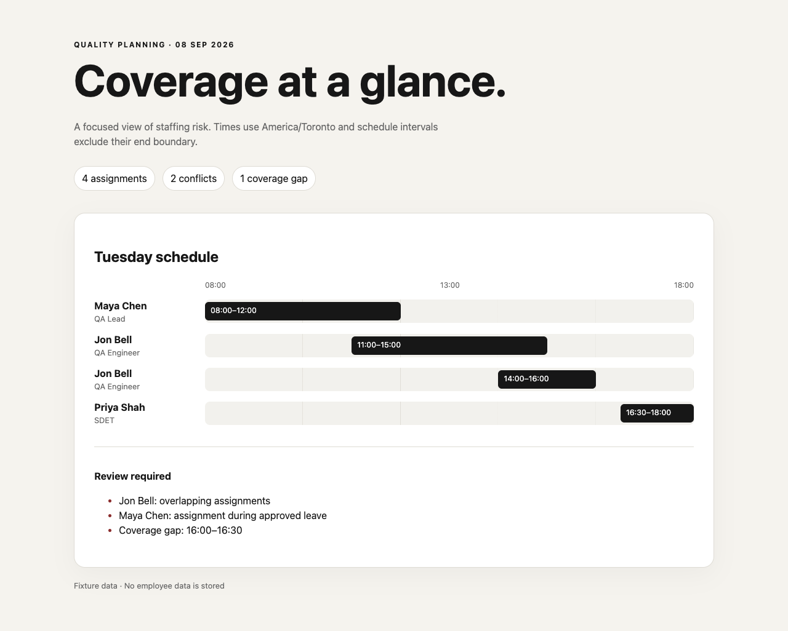
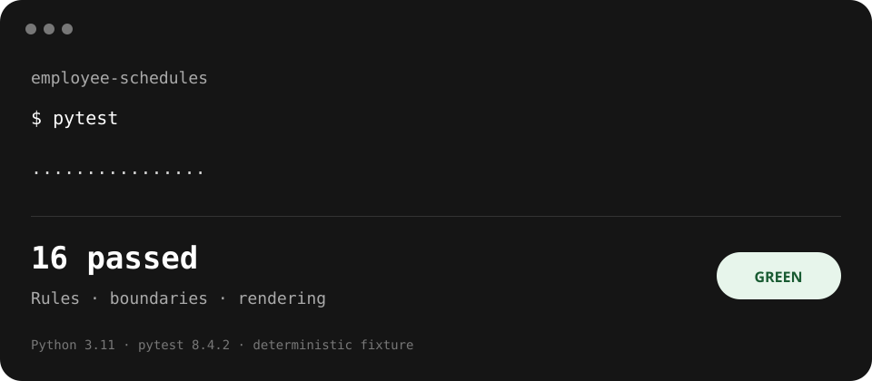

# Employee schedule quality sample

A small, runnable staffing timeline demonstrating senior-level test design around overlapping shifts, approved leave, coverage gaps, timezone handling, and boundary semantics.


The portfolio view translates the tested schedule rules into a Jira-style QA operations report: capacity, conflicts, coverage, decisions, owners, and linked runbooks. It is explicitly labelled as illustrative sample data rather than a client screenshot.





## Run it

Requires Python 3.11+.

```bash
python3 -m venv .venv
source .venv/bin/activate
python -m pip install -r requirements.txt
pytest
python app.py
```

Open `http://127.0.0.1:8010`. The demo has no persistence or production scheduling claims; its fixtures are deliberately small so a reviewer can understand the rules in minutes.

## Quality approach

Times are timezone-aware and intervals are half-open: `[start, end)`. A shift ending at 12:00 does not overlap one beginning at 12:00. A conflict is any positive-duration overlap between one person's shifts, or between a shift and approved leave. Coverage is evaluated across the expected support window; uncovered portions are merged into stable gap intervals.

The tests cover adjacent and overlapping shifts, leave edges, full and partial coverage, invalid intervals, mixed timezones, overnight work, stable output, accessible status labels, and page rendering.

## Files

- `schedule.py` — domain model, rules, and deterministic fixtures
- `app.py` — accessible server-rendered timeline and health endpoint
- `tests/` — fast pytest suite at the rule and rendering boundaries
- `evidence/test-results.svg` — compact, reviewable green-run evidence
- `evidence/jira-scheduling.svg` — illustrative Jira-style management report

## Known limits

This is a portfolio sample, not a workforce-management system. It intentionally omits authentication, persistence, editing, recurrence, payroll rules, and optimization. The next useful increment would add property-based tests for interval combinations before expanding the UI.
