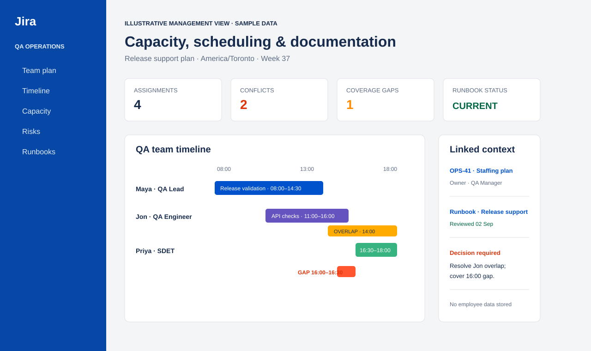

# Jira scheduling and documentation

Illustrative Jira-style leadership evidence for capacity, coverage, and operating docs.

This folder is **not** an automation suite. It holds the screenshot used on the portfolio
to show QA management skills: resource allocation, coverage gaps, schedule conflicts,
owners, and linked runbooks / documentation.

Sample data only — not a confidential client schedule export.
